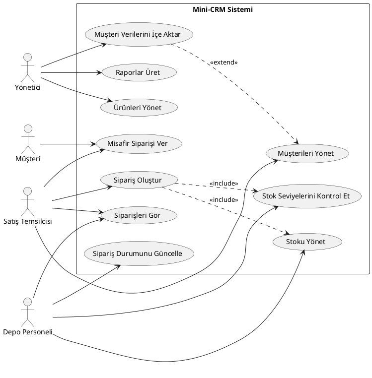
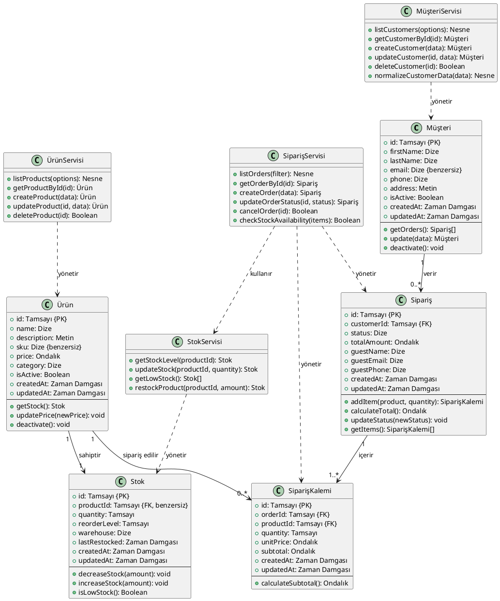

### 3-UML-Diagrams.md (UML Diyagramları)

# UML Diyagramları

**Proje**: Mini-CRM  
**Sürüm**: 1.0  
**Tarih**: 2026-01-11  

Bu belge, Mini-CRM sistemi için PlantUML metin formatında UML diyagramlarını içerir.
Bunlar PlantUML online aracı veya IDE eklentileriyle render edilebilir.

---

## 1. Kullanım Senaryosu Diyagramı

---

## 2. Sınıf Diyagramı

---

 (Not: PlantUML kodları değişmedi, açıklamalar çevrildi. Belgenin geri kalan diyagramları benzer şekilde.)

---